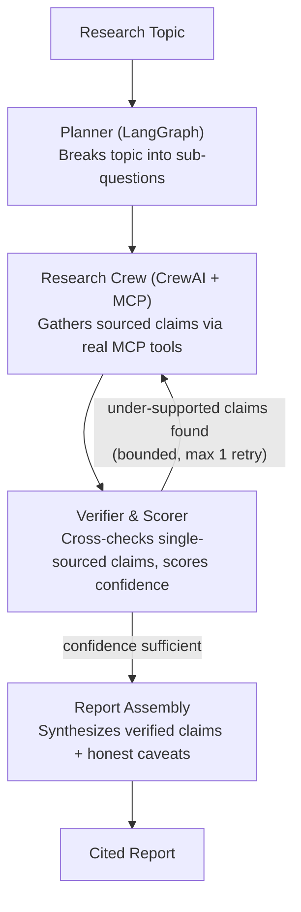

# Deep Research Agent

A multi-agent research pipeline that takes a topic, plans sub-questions, gathers sourced claims through tool-using agents, cross-checks and scores each claim's confidence, retries under-supported research when needed, and produces a cited, honest report — including a transparent section for claims that couldn't be independently verified.

Built as a hands-on deep dive into agent orchestration (**LangGraph**), multi-agent collaboration (**CrewAI**), and real tool integration via the **Model Context Protocol (MCP)**.

---

## Overview

Most "AI research assistant" demos are a single LLM call with search bolted on, producing a confident-sounding wall of text with no way to tell which parts are well-supported. This project is deliberately structured as a **pipeline of specialized, verifiable stages**:

1. A **planner** decomposes a broad topic into concrete, answerable sub-questions.
2. A **research crew**, using real MCP-connected tools (search + page-fetch), gathers evidence and extracts it into **discrete, atomic claims** — each tagged with the source URL(s) that support it.
3. A **verifier** scores each claim's confidence: claims already backed by 2+ independent sources are trusted; claims with only one source trigger a **live, independent corroboration search** before being trusted.
4. If any claim comes back under-supported, a **bounded retry** re-researches just that sub-question, with the verifier's own feedback fed back in as guidance — not a blind re-run.
5. A **report assembly** stage synthesizes the verified claims into a readable, thematically-organized Markdown report — with an honest **"Lower-Confidence Findings"** section for anything that never cleared the bar, rather than silently dropping it or asserting it as fact.

Every stage is inspectable, individually testable, and swappable.

---

## Architecture



| Stage | Framework | Responsibility |
|---|---|---|
| Planner | LangGraph + `with_structured_output` | Breaks the topic into 3-5 structured sub-questions |
| Research Crew | CrewAI + real MCP client (`MCPServerAdapter`) | Agent searches and fetches pages via a standalone MCP server, then a separate structured-extraction pass turns the answer into discrete `Claim` objects |
| Verifier & Scorer | Hybrid: deterministic scoring + narrow LLM judgment | Claims with 2+ sources are trusted by count; single-sourced claims get an active, independent corroboration search before being trusted |
| Retry loop | LangGraph conditional edge | Routes only the specific under-supported sub-questions back to the crew, with the verifier's feedback attached — bounded to 1 retry |
| Report Assembly | LangChain, single call | Synthesizes verified claims into thematic prose with inline citations; low-confidence claims get an honest, separate caveats section instead of being dropped or hidden |

**Why real MCP, not just a native tool function?** MCP defines a genuine client-server boundary — the search/fetch tools run as a standalone process (`mcp_servers/research_server.py`), and CrewAI connects to them as a client. This makes the tools portable across frameworks, not coupled to CrewAI's own tool-calling convention.

**Why two separate LLM abstractions (`langchain_anthropic.ChatAnthropic` and `crewai.LLM`)?** LangGraph/LangChain and CrewAI each own their own model-client type; both ultimately call the same Anthropic API, but you can't pass one framework's client object into the other's — a real, common friction point when composing multiple agent frameworks.

---

## Confidence Scoring — how it actually works

Every claim gets a `confidence: float` (0.0–1.0), computed by a **hybrid rule-based + LLM system**, not a single "rate this 0-1" prompt (which is known to be poorly calibrated and lenient by default):

| Situation | Confidence | Why |
|---|---|---|
| 2+ independent sources from research | 0.9 | Real structural signal already present |
| 1 source, independently corroborated by a fresh search | 0.85 | Genuinely verified, via a live search specifically for that claim |
| 1 source, corroboration search finds nothing independent | 0.4 | Flagged as under-supported — not asserted as fact |
| 0 sources | 0.1 | Defensive floor |

The LLM's role is deliberately narrow: a single binary, reasoned judgment ("does this specific search result genuinely and independently support this specific claim?") — not producing the score itself. The score is deterministic Python given that judgment and the source count, which makes it reproducible and debuggable.

---

## Cost Control — model tiering

LLM calls are routed by task complexity, not run uniformly on the most capable model:

- **Sonnet 5** — planner (shapes the whole run) and final report writing (the actual deliverable)
- **Haiku 4.5** — research agent reasoning, claim extraction, and corroboration judgments (high call volume, well-defined, mechanical tasks)

This follows Anthropic's own stated guidance: reserve the frontier model for tasks that need it, route high-volume/simple tasks to the cheaper, faster tier.

---

## Project Structure

```
deep-research-agent/
├── agents/
│   └── research_crew.py       # CrewAI agent, MCP client wiring, structured claim extraction
├── graph/
│   ├── state.py                # LangGraph state schema
│   ├── schemas.py              # Shared Pydantic models (Claim, ScoredClaim, etc.)
│   ├── verifier.py             # Per-claim confidence scoring + corroboration
│   ├── report.py               # Final report assembly
│   └── workflow.py             # LangGraph graph definition — nodes, edges, retry routing
├── mcp_servers/
│   └── research_server.py      # Standalone MCP server: web_search + fetch_page tools
├── tools/
│   └── search_tool.py          # Original native CrewAI tool (superseded by MCP; kept for reference)
├── tests/
│   ├── test_search_tool.py
│   ├── test_research_crew.py
│   └── test_report.py
├── venv/                        # gitignored
├── .env                         # gitignored — API keys, config
├── .gitignore
├── requirements.txt
├── main.py                      # CLI entry point
└── README.md
```

---

## Roadmap

- [x] **Phase 0** — Environment & repo setup
- [x] **Phase 1** — Planner (LangGraph, structured output)
- [x] **Phase 2** — Research Crew (CrewAI)
- [x] **Phase 2.5** — Real MCP tool servers (web_search, fetch_page)
- [x] **Phase 2.6** — Structured, multi-source claim extraction
- [x] **Phase 3** — Per-claim Verifier & cross-source Confidence Scorer
- [x] **Phase 4** — Bounded, targeted retry loop
- [x] **Phase 5** — Report assembly with honest low-confidence caveats
- [ ] **Phase 6** — n8n trigger + email delivery (planned)
- [ ] RAG chat layer — deferred/optional extension, not required for the core pipeline

---

## Setup

### Prerequisites

- Python 3.10+
- An Anthropic API key from [console.anthropic.com](https://console.anthropic.com) (separate from a claude.ai Pro/Max subscription — API access is billed separately, per token)

### Installation

```bash
git clone <your-repo-url>
cd deep-research-agent

python3 -m venv venv
source venv/bin/activate      # macOS/Linux

pip install -r requirements.txt
```

**Note if you use conda alongside venv:** run `conda deactivate` once after activating the venv, so `python3`/`pip` unambiguously resolve to the project's venv rather than conda's `base` environment.

### Environment variables

Create `.env` in the project root:
```
ANTHROPIC_API_KEY=your-key-here
CREWAI_TRACING_ENABLED=false
```

### Verify setup
```bash
python3 -c "
from anthropic import Anthropic
client = Anthropic()
msg = client.messages.create(model='claude-sonnet-5', max_tokens=100, messages=[{'role': 'user', 'content': 'Say hi in 5 words.'}])
print(msg.content[0].text)
"
```

---

## Usage

```bash
python3 main.py "the impact of remote work on urban housing markets"
```

Or run interactively:
```bash
python3 main.py
```

The final report is written to `output_report.md`. A full run typically takes several minutes, since it involves multiple real LLM calls and live web searches per sub-question, plus verification.

### Running tests
```bash
pytest tests/ -v -m "not slow"   # fast suite, no real API calls
pytest tests/ -v                 # full suite, includes real API/integration tests
```

---

## Concepts Demonstrated

- State graphs, conditional routing, and bounded retry loops (LangGraph)
- Role-based multi-agent collaboration (CrewAI)
- Real client-server tool integration via the Model Context Protocol (MCP)
- Structured LLM output, including defensive handling of inconsistent output shapes
- Hybrid rule-based + LLM confidence scoring, designed around known LLM judge leniency bias
- Cost-aware model tiering across a multi-step pipeline
- Debugging real, current framework/model compatibility issues (not just textbook bugs)
- Secrets management, environment reproducibility, and git hygiene

---

## License

MIT

## Author

*Abhradeep Mukherjee*