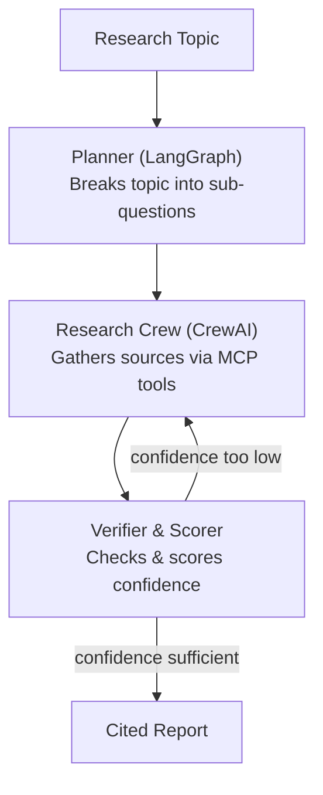

# Deep Research Agent

A multi-agent research pipeline that takes a topic, plans sub-questions, gathers sources through tool-using agents, verifies and scores the findings, and produces a cited report — with an automatic retry loop when confidence is too low.

Built as a hands-on deep dive into agent orchestration (**LangGraph**), multi-agent collaboration (**CrewAI**), and tool integration via the **Model Context Protocol (MCP)**.

---

## Overview

Most "AI research assistant" demos are a single LLM call with search bolted on. This project is deliberately structured as a **pipeline of specialized stages**, each with a clear responsibility and a clear handoff to the next:

1. A **planner** decomposes a broad topic into concrete, answerable sub-questions.
2. A **research crew** of collaborating agents gathers sources for those sub-questions using external tools.
3. A **verifier** checks the gathered evidence for quality and coverage, and scores confidence.
4. If confidence is too low, the pipeline **retries** the research step — not from scratch, but informed by what the verifier flagged.
5. Once confidence clears the bar, the findings are assembled into a **cited report**.

The goal is a system where every stage is inspectable, testable, and swappable — not a black box prompt.

---

## Architecture



| Stage | Framework | Responsibility |
|---|---|---|
| Planner | LangGraph | Breaks the research topic into a structured set of sub-questions |
| Research Crew | CrewAI | Multiple collaborating agents gather evidence per sub-question, using MCP-connected tools (search, fetch, etc.) |
| Verifier & Scorer | LangGraph node | Cross-checks sources, scores confidence per sub-question, decides retry vs. proceed |
| Retry loop | LangGraph conditional edge | Routes back to the Research Crew with feedback on what was insufficient |
| Report assembly | LangGraph node | Aggregates verified findings into a final cited report |

**Why two frameworks?** LangGraph governs the overall control flow — it's a state machine, so it's the right tool for "what happens next, and under what condition." CrewAI governs what happens *inside* the research step — a group of agents with distinct roles collaborating on a shared task. Using LangGraph to orchestrate a CrewAI crew as one node is a common real-world pattern, and demonstrates both graph-based and role-based agent design in one project.

---

## Tech Stack

- **Orchestration:** [LangGraph](https://github.com/langchain-ai/langgraph) — state graph for planning, verification, and control flow
- **Multi-agent collaboration:** [CrewAI](https://github.com/crewAIInc/crewAI) — role-based agents for the research step
- **Tool access:** [MCP (Model Context Protocol)](https://modelcontextprotocol.io) — standardized tool connections for search/fetch
- **LLM:** Claude (Anthropic API)
- **Language:** Python 3.11+
- **Secrets management:** `python-dotenv`

*(Retrieval/RAG layer for follow-up chat is planned — see Roadmap.)*

---

## Project Structure

```
deep-research-agent/
├── agents/
│   ├── planner.py          # LangGraph planner node
│   ├── research_crew.py    # CrewAI agents + tasks
│   └── verifier.py         # scoring & confidence logic
├── graph/
│   └── workflow.py         # LangGraph StateGraph definition, edges, retry routing
├── tools/
│   └── mcp_tools.py        # MCP tool client/config
├── rag/                    # Phase 6: retrieval layer for follow-up chat
├── tests/
├── requirements.txt
├── main.py                 # entry point
└── README.md
```

---
## Setup

### Prerequisites

- Python 3.11+
- An Anthropic API key from [console.anthropic.com](https://console.anthropic.com) — **note:** this is separate from a claude.ai Pro/Max subscription, which does not include API access

### Installation

```bash
# Clone and enter the project
git clone <your-repo-url>
cd deep-research-agent

# Create and activate a virtual environment
python3 -m venv venv
source venv/bin/activate      # macOS/Linux
# venv\Scripts\activate       # Windows

# Install dependencies
pip install -r requirements.txt
```

### Environment variables

Create a `.env` file in the project root:

```
ANTHROPIC_API_KEY=your-key-here
```

`.env` is gitignored — never commit real keys.

### Verify setup

```bash
python3 -c "
from anthropic import Anthropic
client = Anthropic()
msg = client.messages.create(
    model='claude-sonnet-4-6',
    max_tokens=100,
    messages=[{'role': 'user', 'content': 'Say hi in 5 words.'}]
)
print(msg.content[0].text)
"
```

---

## Concepts Demonstrated

This project is built as a learning exercise as well as a portfolio piece. Concepts covered by the end:

- State graphs and conditional routing (LangGraph)
- Role-based multi-agent collaboration (CrewAI)
- Standardized external tool access (MCP)
- Confidence scoring and self-correction loops in agentic systems
- Retrieval-augmented generation for grounded, multi-turn Q&A
- Secrets management and reproducible environments

---
## Author

*Abhradeep Mukherjee*
